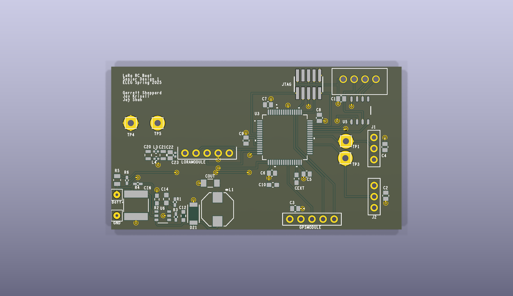
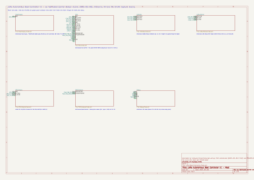

# LoRa Autonomous Boat Controller

An RC-scale autonomous surface vessel controller: an STM32F446 takes thrust and rudder commands from a handheld over a 915 MHz LoRa link (Reyax RYLR UART module), reads a NMEA GPS, and drives a brushless ESC and a rudder servo with 50 Hz servo PWM. Built as a University of Arkansas EECS senior design project in Cadence OrCAD/Allegro 22.1, fabricated in May 2025 ("senior design v5"), and now reconstructed in KiCad 9 as the baseline for a V2 redesign.

**Start with [REPORT.md](REPORT.md)** (five minutes) or [docs/INDEX.md](docs/INDEX.md) (everything). The interactive project manager, when present, is at `pm/index.html`.

| | |
|---|---|
|  |  |
| V1 as fabricated, reconstructed in KiCad 9 (66.5 × 37.3 mm, 2 layers) | V1 root schematic (one sheet per OrCAD block) |

## V1 → V2 in one paragraph

V1 works as a radio-controlled boat but has no link-loss failsafe (the last thrust value persists forever), puts the MCU's 3.3 V logic rail on the servo/ESC power pins, returns the STM32's VCAP capacitor to +3V3 instead of ground, wires the CAN transceiver to pins the CAN peripheral cannot use, runs everything from the internal RC oscillator, and leaves the battery input unprotected. All of this is documented with copper-level evidence in [docs/V1_DESIGN_REVIEW.md](docs/V1_DESIGN_REVIEW.md). V2 ([docs/V2_REQUIREMENTS.md](docs/V2_REQUIREMENTS.md), `hardware/kicad_v2/`) keeps the proven parts (STM32F446, R1240N buck, 2-layer form factor, ARM debug connector) and adds the failsafe/watchdog, a separate actuator rail with input protection, an HSE crystal, status LEDs, PPS/IMU for navigation, an external antenna port and mounting holes.

## Repository map

```
README.md, REPORT.md          start here / the report
CONVERSION_LOG.md             append-only work log (what changed, what was validated, commits)
BLOCKERS.md                   decisions Jay must make + defaults in use; AGENT_STATUS.md, HANDOFF.md, FILE_OWNERSHIP.md: agent coordination
PROMPT_FOR_CODEX.md           brief for the second (review/documentation) agent
docs/
  INDEX.md                    table of every document and image
  A0_PROVENANCE.md            which artwork is the fabricated board, v2→v5 placement diff, drill provenance, Gerber XOR tables
  V1_DESIGN_REVIEW.md         findings with evidence + link budget / control / power analysis
  V2_REQUIREMENTS.md          numbered testable requirements + decision list
  NETLIST.md                  every net (generated); CONVERSION_NOTES.md: method + footprint mapping; BOM.csv, BOM_V2.csv (generated)
  research/                   datasheet notes, MPN/pricing research, firmware review (line-cited)
  img/                        renders, layer SVGs, XOR images, evidence figures, schematic PDF/SVGs
  archive/                    superseded March-2026 pipeline docs
hardware/kicad/               V1 KiCad 9 project (as fabricated): LoRa_Boat_Controller.kicad_pro / .kicad_pcb / .kicad_sch + 7 sheets,
                              LoRa_Boat_Controller.pretty/ (project footprints), .kicad_sym (project symbols), .kicad_dru (as-fabricated rules)
hardware/kicad/tools/         every script that produced the above (see "Regenerate")
hardware/kicad_v2/            V2 KiCad project (Phase C draft): LoRa_Boat_Controller_V2.kicad_pro / .kicad_pcb (80 x 46 mm, autorouted) / root + 6 sheets,
                              generated from tools/v2_design.py by tools/gen_v2.py; tools/route_v2.py drives freerouting; README.md explains the chain
firmware/                     V1 STM32CubeIDE project (unchanged behaviour; header comments document the board wiring) + V2_FIRMWARE_PLAN.md
Allegro/hardware/allegro-original/   read-only source evidence: Allegro v5/ (board revisions, logs, OrCAD netlist pstxnet.dat),
                              BoatcrewArtwork/ (the v5 fabrication Gerbers), LIBRARY_MASTER/ (Allegro footprints)
reviews/codex/                independent review packet by the second agent
```

## What is actually in the Allegro folder (read this before trusting older notes)

- `BoatcrewArtwork/BOATCREW*.art` are the fabrication films: plotted from `senior design v5.brd` on 2025-05-09 17:41, the last thing Allegro did (`allegro.jrl`). They are the copper ground truth.
- `Allegro v5/Allegro/pstxnet.dat` (+ `pstxprt.dat`, `pstchip.dat`) is the OrCAD netlist imported into v5 half an hour earlier: 44 parts, 32 nets + 37 unconnected pins. This, not the older `senior design v2.dsn`, is the connectivity truth.
- `senior design v2.dsn` is a Specctra export of **v2**: a 76.2 × 76.2 mm board with 45 parts on a different placement. v5 is 66.5 × 37.3 mm; every part moved; U1/COUT1/TP2 are gone and D21 was added. The DSN is only used for pad geometry.
- `BOATCREWDRILL-1-2.drl` is a **v4** drill (35 of 50 holes don't exist on v5); the KiCad drill is derived from the v5 pad flashes and matches them hole for hole.
- `Allegro v5/Allegro/Artwork/` and `Artwork.zip` are v4; `SENIORDESIGN_BOARD.png` is a screenshot of the OrCAD start page.

## Opening the projects in KiCad 9

- V1: open `hardware/kicad/LoRa_Boat_Controller.kicad_pro`. Libraries are project-local (`fp-lib-table`, `sym-lib-table`); no global library setup is needed except the standard KiCad 9 symbol libraries (`MCU_ST_STM32F4`, `Device`, `Connector*`, `power`) that ship with KiCad. The board opens with zones filled; DRC runs with the project's `.kicad_dru` (0 errors, 67 documented warnings). ERC 0.
- V2: open `hardware/kicad_v2/LoRa_Boat_Controller_V2.kicad_pro`. Same library conventions (project-local tables; the V1 `.pretty` is reused through `${KIPRJMOD}/../kicad/`). The board is an autorouted draft (freerouting 2.1.0) with DRC 0 errors; see `hardware/kicad_v2/README.md` for the state of the draft and what still needs hand work before fabrication.

Reference designators without a trailing digit in Allegro (`CANHEADER`, `LORAMODULE`, `GPSMODULE`, `SPEEDCONTROLLER`, `STEERINGSERVO`, `JTAG`, `CIN`, `COUT`, `CEXT`, `VIN`, `GND`) are `…1` in KiCad (annotation rule); the Allegro name is in every symbol's `Allegro_RefDes` field and in `docs/BOM.csv`.

## Regenerate everything

Requirements: KiCad 9.0.7 (default path `C:\Users\Jay\AppData\Local\Programs\KiCad\9.0\bin`, override with `KICAD_BIN`), Python 3.12 with `pip install gerbonara sexpdata kiutils numpy scipy shapely pillow`.

```bash
python hardware/kicad/tools/build_v1.py
```

runs, from the repo root: provenance → v5 reconstruction (placement + connectivity from the films and pstxnet.dat) → footprints → board + project + rule file → pcbnew validation and zone fill → DRC → Gerber/drill export → XOR fidelity check → DSN-v2 comparison → evidence figures → renders/SVGs → symbols → schematic → ERC → netlist check → BOM → schematic PDF/SVG → NETLIST/CONVERSION_NOTES/INDEX. Every script has a header stating its inputs and outputs and can be run alone (`python hardware/kicad/tools/<script>.py`; `validate_pcb.py` and `check_netlist.py` need KiCad's own `python.exe`). Outputs that are evidence go to `docs/`; intermediate JSON goes to `hardware/kicad/_build/` (gitignored).

To regenerate V2: `python hardware/kicad_v2/tools/gen_v2.py` (library, schematic, project, unrouted board, `docs/BOM_V2.csv`), then `route_v2.py all` with KiCad's `python.exe` to autoroute (needs Java 21 + freerouting 2.1.0; details in `hardware/kicad_v2/README.md`).

Phase A validation as of the `v1-kicad-baseline` tag: 172/172 pads within 0.000 mil of the film flashes; DRC 0 errors / 0 unconnected; ERC 0 violations; schematic and board pin sets identical to `pstxnet.dat`; Gerber XOR vs the films F.Cu 0.87 %, B.Cu 0.23 %, masks < 1 %; drill 53/53 holes within 0.05 mil.

## Firmware

`firmware/` is the V1 STM32CubeIDE project (bare-metal HAL, `Core/Src/main.c` ≈ 750 lines: RYLR AT init, `+RCV=` parsing, RMC parsing, two PWM channels, 5 s telemetry). Behaviour is unchanged; the header comments now state the copper-verified wiring (PA8/TIM1 → SPEEDCONTROLLER header, PC6/TIM3 → STEERINGSERVO header, PB0 → GPS pin 3). See `docs/research/FIRMWARE_REVIEW_NOTES.md` for the line-cited review and `firmware/V2_FIRMWARE_PLAN.md` for V2.

## Companion hardware

The boat node is address 1 on network 18; the handset (STM32L072 + matching RYLR module, address 2) is not in this repository.

## License

Senior design project — University of Arkansas EECS.
