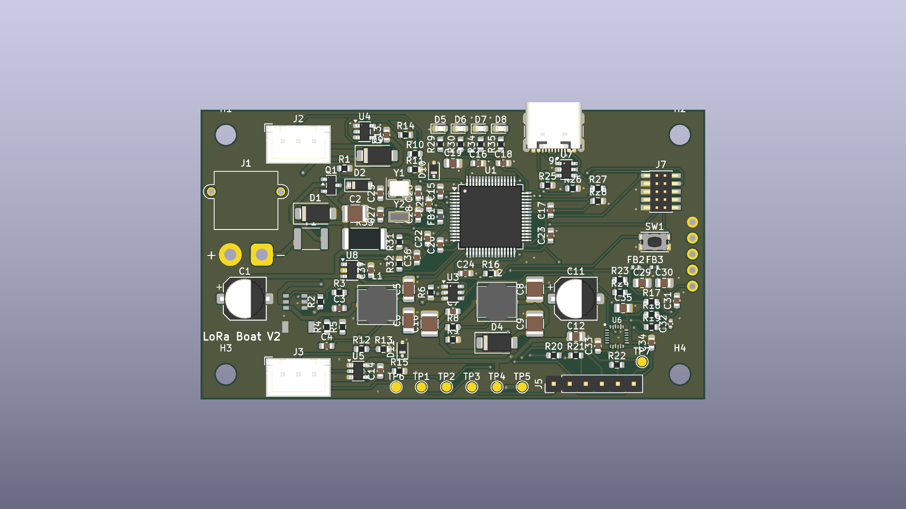
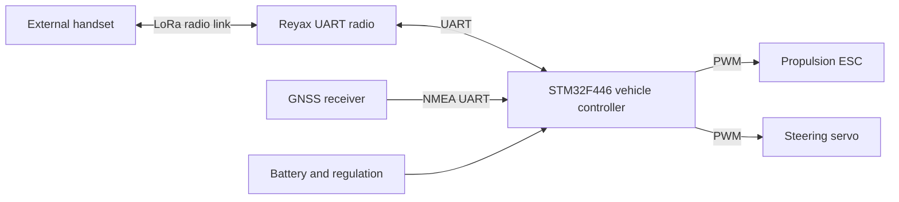

# LoRa Autonomous Boat Controller

An embedded-systems project spanning **STM32 firmware, LoRa communication, PCB reconstruction and a documented V2 redesign**. The original university boat controller is preserved as V1; the next vehicle node and a voice/text/location handheld are under development.

**Current milestone: engineering review edition.** The schematics, source code, parts and build procedures are available for inspection. V2 is not fabrication-ready, and the preserved V1 firmware build is not hardware-qualified.

[Portfolio case study](docs/portfolio/README.md) · [Application handbook](docs/applications/README.md) · [Build and assembly guide](docs/build/README.md) · [Latest verification](reviews/codex/design_completion/HANDOFF.md) · [Project history](REPORT.md)

| Existing controller | Developing controller |
| --- | --- |
|  |  |
| V1: 44 physical components, reconstructed from original fabrication evidence | V2: 118 physical references, 80 × 46 mm board draft |

These are CAD renders. They do not establish that the V2 board has been manufactured or tested.

## Explore the project

Clone or download the repository, then open [pm/index.html](pm/index.html) locally. For the complete interactive workspace with searchable BOMs, datasheets, drawings, connector evidence and assembly/programming guides:

```sh
node pm/tools/serve.mjs
```

Open **http://127.0.0.1:8765/pm/**. The viewer runs locally and requires no account or package installation. GitHub displays the HTML source; it does not run the viewer from a repository file link. See [viewer instructions](pm/README.md).

The [portfolio handoff](docs/portfolio/README.md) and [structured project data](docs/portfolio/portfolio.json) provide captions, asset paths, result evidence and claim boundaries for a portfolio site.

## Architecture and implementation



V1 firmware is bare-metal C using STM32 HAL/CMSIS, with UART radio commands, GPS parsing and two PWM outputs. The original handset source is not included. The current code has known failsafe, parsing and pin-role issues documented in the [firmware audit](docs/research/FIRMWARE_REVIEW_NOTES.md).

Hardware originated in Cadence OrCAD/Allegro and has been reconstructed in KiCad 9. Python tools generate and inspect schematics, compare complete pin groups and prepare assembly evidence. The viewer uses HTML, CSS and JavaScript with embedded project data; Node.js builds and validates it. GitHub Actions separates portable repository checks from optional native CAD and firmware jobs.

V2 adds draft provisions for protected power, a separate actuator rail, sensing and USB/debug access. The separate [Stage A diagnostic](firmware_v2/README.md) now builds for board identity and inactive actuator outputs. Corrected control firmware, autonomous navigation and the proposed voice/text/location handheld remain development targets. Voice airtime and RC coexistence must be validated before choosing handheld hardware.

## What has been demonstrated

| Deliverable | Recorded result | Evidence |
| --- | --- | --- |
| Readable schematic set | 15 annotated pages, visually inspected | [V1 PDF](docs/img/v1_schematic.pdf), [V2 PDF](docs/img/v2_schematic.pdf), [visual review](reviews/codex/professionalization/VISUAL_REVIEW.md) |
| Electrical preservation | All 172 V1 and 361 V2 pins preserved through the presentation changes | [Independent quality evidence](reviews/codex/professionalization/QUALITY_HANDOFF.md) |
| V1 firmware reconstruction | Two same-host builds produced identical ELF/HEX/BIN hashes; 36,528-byte BIN | [Build record](docs/build/FIRMWARE_HANDOFF.md) |
| Ordering and assembly | BOM reconciliation, held-part decisions, one-board/five-board candidate lists and assembly maps | [Ordering guide](docs/build/ORDERING.md) |
| Navigation and documentation | Searchable parts, selected datasheets, V1 connector atlas, source evidence and version-specific programming guides | [Workspace](pm/README.md), [build guide](docs/build/README.md) |
| Reproducible review | Regression tests, source hashes, native reports and preserved before/after evidence | [Review workflow](docs/build/REVIEW_WORKFLOW.md) |

The integrated V2 ground repair reduces **three unconnected PCB items to zero**, with zero ordinary DRC errors and unchanged warning/parity counts. The [fresh native review](reviews/codex/design_completion/native-review/REVIEW.md) preserves all 533 electrical pins. One V2 ERC warning remains; the strict review also flags the intentional PCB change against its older preservation baseline. Six [component-limit blockers](reviews/codex/design_completion/electrical/README.md) require circuit corrections before fabrication. No range, voice or autonomous-navigation performance is claimed by these software/CAD results.

## Build, review and contribute

- [V1 assembly and inspection](docs/build/ASSEMBLY_V1.md) · [V1 backup/flashing procedure](docs/build/FLASHING_V1.md)
- [V2 assembly review](docs/build/ASSEMBLY_V2.md) · [V2 firmware bring-up plan](docs/build/FLASHING_V2.md)
- [Safe schematic-only regeneration](docs/build/SCHEMATICS.md) · [Reproducible firmware build](docs/build/FIRMWARE_BUILD.md)
- [Independent review workflow](docs/build/REVIEW_WORKFLOW.md) · [Publication and portability record](reviews/codex/publication/README.md)

Do not run full PCB generation or routing merely to refresh drawings. The schematic-only command preserves the existing PCB, project and BOM. Native KiCad checks require KiCad 9; the V1 build requires the recorded GNU Arm toolchain. No CI job flashes real hardware.

The [IMU interface candidate](reviews/codex/imu_interface/README.md) now implements the proposed 1.8 V supply and I2C/interrupt translation in a separately checked schematic. It is available in the V2 viewer; live PCB integration is the next layout task.

## Next milestones

1. Correct the IMU's 1.8 V interface and the five remaining power/signal-limit findings; reconcile schematic-to-PCB differences.
2. Build on the separate Stage A diagnostic: freeze the operational protocol, implement supervised outputs and measure failsafe behavior.
3. Complete part/footprint qualification, the V2 connector atlas and staged physical bring-up.
4. Validate voice quality, radio airtime and RC scheduling before developing the handheld.

## Provenance and attribution

The original controller was a University of Arkansas EECS senior-design team project; the repository identifies May 2025 fabrication evidence. The current reconstruction, documentation and review tooling include AI-agent-assisted development. Individual original team contributions should be confirmed before using first-person portfolio claims.

`Allegro/` preserves original source evidence. Read [provenance and conversion limits](docs/A0_PROVENANCE.md) before interpreting the reconstructed geometry or inferred drill data. Third-party firmware and tools retain their existing notices; no new project-wide license is granted by this documentation.
