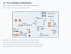

# V1 existing-board assembly and repair reference

V1 is the faithful reconstruction of the existing boat controller. Its 44 footprints describe the original hardware, including its defects. This guide supports identification, inspection and a separately approved repair plan. It does not authorize blindly rebuilding or powering the original circuit.

## Identify the hardware

Use [BOM review](../../hardware/manufacturing/v1/bom_review.csv), the [connector atlas](../atlas/README.md), [schematic](../img/v1_schematic.pdf), and [design review](../V1_DESIGN_REVIEW.md) together. The BOM preserves both Allegro and KiCad names: for example, `LORAMODULE` becomes `LORAMODULE1`. This matters when comparing the old board, original drawing and reconstructed CAD.

[Top map](../../hardware/manufacturing/v1/assembly_top.svg) · [Underside map](../../hardware/manufacturing/v1/assembly_bottom.svg) · [Orientation review](../../hardware/manufacturing/v1/orientation_review.csv) · [Position reference](../../hardware/manufacturing/v1/positions_review.csv)

Orange pads identify electrical pin `1`/`01`. They do not universally identify a diode cathode, capacitor positive terminal or connector key. Grey boxes are pad envelopes, not package bodies. The underside map is mirrored horizontally; the CSV coordinates remain top-view coordinates. Match the actual package marking to the manufacturer's exact package drawing and record that check in the orientation table.

## Resolve these before powered work

| Item | Existing-board issue | Required recorded disposition |
|---|---|---|
| CEXT1 / MCU VCAP | The capacitor's second terminal is on +3V3 instead of VSS | Approved repair/respinned connectivity and inspected result |
| Actuator power | Both actuator header pin-1 connections are on +3V3 | Verified harness power plan that prevents BEC/servo power from driving the logic rail |
| PWM identity | PA8 reaches SPEEDCONTROLLER; PC6 reaches STEERINGSERVO. Firmware uses PA8 for rudder and PC6 for thrust | Actual harness labels, continuity record and unloaded scope trace |
| GPS pin 3 | PB0 is driven LOW by the existing firmware | Exact GPS pin function and firmware/pin disposition |
| CAN | RXD reaches PA10, which is unsuitable for the intended CAN peripheral | Approved rework or documented unsupported function |
| MCU boot/supply | BOOT0 and VBAT have source connectivity concerns | Approved startup/supply corrections |
| C23 and uncertain BOM entries | Value conflict and proposed rather than established selections | Resolved held-parts list with exact MPN and ratings |
| Radio | Installed module model and supported settings remain unconfirmed | Exact module identification and verified mating pinout |

These are source-derived issues, not measured failures of this particular physical board. See the linked design review and atlas evidence before altering hardware. Keep the original board and any rework marked with their distinct revision and serial number.

## Inspection and staged verification record

Use a copy of this checklist per physical board. Record the date, board ID, firmware hash, instruments and the person performing each step. Leave failed or unperformed checks open.

- [ ] Photograph both sides and every attached module/harness before changing anything. Identify board revision and any previous rework.
- [ ] Match populated reference/value/package markings to the BOM. Resolve all parts actually being purchased against `holds.csv`; do not buy bare VIN/GND/test pads.
- [ ] Inspect IC pin-1 dots, diode band/pin numbering and connector pin-1/key orientation with the orientation table. Inspect solder bridges and lifted pads under magnification.
- [ ] With all power and external modules/actuators disconnected, record continuity of the repaired VCAP return, ground, input polarity, logic rail and actuator isolation. Record resistance observations rather than treating a beeper as electrical sign-off.
- [ ] Approve a board-specific supply voltage/current-limit plan from the corrected circuit and actual loads. Keep actuators disconnected for first power.
- [ ] Observe input current and each rail with the agreed acceptance limits. Capture startup/reset behavior and investigate unexpected heating or current before adding loads.
- [ ] Verify SWD wiring, device identity, reset/BOOT state and firmware version. A successful flash is not proof of safe output behavior.
- [ ] Capture PA8 and PC6 pulses at startup, reset and command transitions with no actuators connected. Resolve the C versus CubeMX TIM3 startup discrepancy before regeneration or powered motion.
- [ ] Test command freshness, explicit arming, malformed-message rejection, link loss and CPU fault recovery in corrected firmware. The existing firmware does not supply a link-loss failsafe.
- [ ] Identify and attach radio/GPS only after supply and pin mapping checks. Capture accepted AT settings and GPS traffic; verify the GPS transmit line is not receiving unintended debug output.
- [ ] Conduct restrained actuator testing only under the approved harness/power/failsafe plan. Record commanded versus measured output behavior.
- [ ] Archive photographs, continuity data, scope captures, firmware hash, repair drawing, open issues and acceptance signature.

No bench step above has been performed by generating these documents. The [run manifest](../../hardware/manufacturing/run_manifest.json) records the exact electronic files used for the reference maps.
