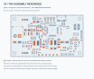

# V2 vehicle-node assembly preparation

The current V2 is a vehicle-node design draft. It is the starting point for the multifunction boat/ground-vehicle platform; it does not contain the handheld's display, controls, voice codec or complete communication hardware. Assembly planning can proceed from this packet, while fabrication waits for a recorded design release.

## Assembly references

[Top map](../../hardware/manufacturing/v2/assembly_top.svg) · [Underside map](../../hardware/manufacturing/v2/assembly_bottom.svg) · [BOM review](../../hardware/manufacturing/v2/bom_review.csv) · [Orientation review](../../hardware/manufacturing/v2/orientation_review.csv) · [Position reference](../../hardware/manufacturing/v2/positions_review.csv)

The maps come from the embedded footprints and pads in the existing PCB file. Orange indicates electrical pad `1`/`01`. For each IC, connector, diode, LED, transistor and electrolytic capacitor, match the exact manufacturer's package marking and pin/polarity definition to the electrical pad map. A pin-1 marker is not a universal cathode/positive mark. Grey outlines represent pad envelopes, not body/courtyard dimensions. Use the underside view for bottom-side work; its visual mirror does not change the CSV coordinate convention.

The draft has 118 PCB items, including 7 bare test points and 4 mounting holes. Those 11 features are not purchased components. Parts grouped in the original BOM may share a description from the first reference in the group; use the schematic to identify each reference's circuit function.

## Freeze the assembly variant

| Choice | References | Decision before ordering |
|---|---|---|
| On-board 5 V converter | U3, R6, C7, L2, R8, R9, C8, C9, C10, D4 | Confirm BEC input, VSERVO sources, back-feed behavior and the complete population choice |
| LSE clock | Y2, C27, C28 | Confirm firmware clock use, exact crystal/load selection and complete population choice |
| GNSS connector | J5 | Check selected MPN's body/mating geometry against the generic footprint |
| SWD connector | J7 | Check keyed Samtec variant, pin 1 and mechanical envelope |
| TVS / OR-ing diode ordering | D1, D4, D9 | Confirm full manufacturer ordering codes and circuit voltage/rating suitability |
| Radio and GNSS modules | External to the controller BOM | Select exact modules, pinouts, antennas and harnesses |

The candidate import files exclude held population choices. They are not a complete kit until the decisions above and [other external hardware](../../hardware/manufacturing/v2/external_parts_review.csv) are resolved.

## Release checks before fabrication

- [ ] Freeze the intended V2 scope and revision: boat, Ackermann, differential drive and fleet functions must map to actual interfaces and firmware requirements.
- [ ] Resolve the electrical review, including power protection and rail-source behavior, IMU supply/interface requirements, radio compatibility and actuator outputs.
- [ ] Run fresh ERC, PCB DRC including unconnected items, schematic/PCB parity, and BOM/PCB reference checks on the exact files to be released. Archive those outputs with input hashes. Old draft summaries are not current validation.
- [ ] Review buck-converter loops, fine-pitch grounding, USB routing, clocks, antenna placement and return paths. A clean DRC alone does not establish functional layout quality.
- [ ] Approve package land patterns, connector mechanics, pin-1/polarity marks, accessibility, enclosure/mounting and all population options.
- [ ] Confirm fabricator stack-up, outline, drill, copper, finish and stencil/assembly requirements. Inspect the final plotted layers and drill registration.
- [ ] Have the assembler review every orientation-sensitive reference. Convert raw KiCad rotations/origin to its centroid convention and approve a first-article drawing.
- [ ] Sign the release record before submitting fabrication or assembly files. This packet does not supply that sign-off.

## First-article assembly and test sequence

1. **Incoming inspection.** Record board serial/revision and quote/reel labels. Check PCB dimensions, drill registration, mask openings and connector fit. Reconcile delivered MPNs and approved substitutions with the frozen population list.
2. **Assembly preparation.** Use the approved stencil and the component manufacturers' soldering profiles. Assemble fine-pitch packages with the chosen process and inspect accessible joints; plan inspection for the IMU's hidden pads. Finish larger connectors according to the agreed assembly process.
3. **Unpowered checks.** Verify polarity and pin-1 orientation using the signed table. Inspect for bridges. Measure rail-to-ground observations, input path, VCAP return, actuator/logic isolation and selected power-source paths against the approved schematic.
4. **Power-only verification.** Keep modules and motion hardware disconnected. Use the approved voltage/current-limit plan; capture inrush, rail voltages/ripple, current-sense behavior and thermal observations. Record acceptance limits from the released design rather than inventing them during test.
5. **MCU and clocks.** Verify reset/BOOT, SWD identification, firmware hash and both required clocks. Record VCAP and supply startup observations. Confirm USB/debug behavior without sharing the GNSS command path.
6. **Interfaces.** Check actual radio/GNSS pinouts and supply levels before connection. Log radio identification/configuration acknowledgement, GNSS update rate/PPS and IMU identity/calibration. Validate the chosen antenna location in the assembled enclosure.
7. **Unloaded control.** Scope PWM and output levels through startup, reset, arm/disarm, link loss, stale/corrupt packets and watchdog/fault recovery. Verify a recovered link cannot silently re-arm.
8. **Controlled loads.** Test the selected servo/BEC supply arrangement, then restrained actuators and each vehicle profile. Capture power dips, resets, current readings and output behavior. Proceed to a five-board build only after the first article passes the recorded criteria.

The script produces assembly references and quantity checks. It does not perform any of these bench tests. Keep each measurement and decision attached to the exact board and firmware revision in the [handoff record](PROCUREMENT_HANDOFF.md).
