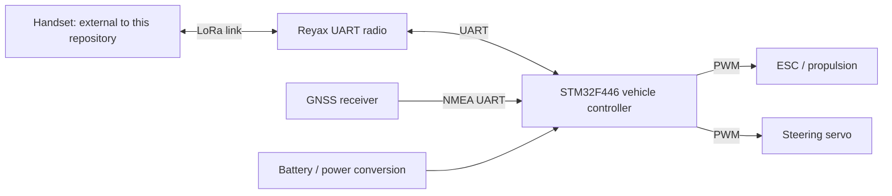

# LoRa controller: from legacy board to reviewable platform

**Embedded systems, PCB reconstruction and engineering documentation.** This project turns an existing university boat-controller design into an inspectable KiCad workspace, with an evolving multifunction vehicle node and a future handheld. The current milestone is a documented engineering review edition with application guides and a separate V2 identity diagnostic. It is not a production release.

> A LoRa vehicle-controller project combining STM32 firmware, PCB reconstruction and an interactive engineering workspace. The repository preserves the original boat hardware, presents fifteen annotated schematic pages, traces connectors and parts to source evidence, and provides a reproducible V1 firmware build. A second-generation controller and voice/text/location handheld are under development, with verification results and unresolved design decisions recorded alongside the design.

[Explore the workspace](../../pm/index.html) · [Build and assembly guide](../build/README.md) · [Structured portfolio data](portfolio.json) · [Latest engineering handoff](../../reviews/codex/design_completion/HANDOFF.md)

## Context and contribution boundaries

The original University of Arkansas EECS senior-design team developed the boat controller in Cadence OrCAD/Allegro; the repository identifies May 2025 fabrication evidence. The present work reconstructs that legacy design in KiCad 9, investigates its defects, improves navigation and documentation, and prepares a V2 redesign. Original provenance and conversion limits are recorded in [A0_PROVENANCE.md](../A0_PROVENANCE.md).

The reconstruction, tooling and documentation include AI-agent-assisted development and independent review packets. This page describes repository deliverables, without assigning the original team's individual hardware or firmware contributions to Jay. Confirm his original role before writing a first-person portfolio account.

## Design and software

The V1 source implements a UART-connected Reyax LoRa radio interface, NMEA GPS parsing and 50 Hz PWM outputs for an ESC and steering servo around an STM32F446. Its bare-metal C firmware uses STM32 HAL/CMSIS and STM32CubeIDE/CubeMX project inputs. These are implementation facts, not newly measured radio or navigation performance. The handset source is absent from this repository. See the [firmware review](../research/FIRMWARE_REVIEW_NOTES.md).

The V2 CAD draft expands power protection, actuator-rail separation, sensing and debug provisions. Fail-safe control, watchdog behavior, corrected parsing, heading hold and waypoint navigation remain implementation/acceptance work. The proposed handheld must support **voice, text and location** alongside RC control; radio airtime and worst-case control blocking must be validated before selecting its hardware. [Requirements](../V2_REQUIREMENTS.md) and the [platform concept](../../reviews/codex/PLATFORM_CONCEPT.md) distinguish these targets from delivered capabilities.

Python tools generate and review CAD, assemble purchasing evidence and compile preserved firmware. The local viewer uses HTML, CSS and JavaScript with embedded data; Node.js builds and validates the workspace. GitHub Actions defines automatic repository/evidence checks and separately opted-in native CAD/firmware jobs. A repository check is not hardware acceptance; consult the actual published run before claiming hosted execution. See [review workflow](../build/REVIEW_WORKFLOW.md).

## Demonstrated results

| Result | Evidence and scope |
| --- | --- |
| Fifteen grouped, annotated schematic pages | [Visual review](../../reviews/codex/professionalization/VISUAL_REVIEW.md); all pages inspected after PDF/SVG export |
| Presentation edits preserve all 533 electrical pins | [Final independent review](../../reviews/codex/professionalization/QUALITY_HANDOFF.md): V1 44 components / 172 pins, V2 114 electrical components / 361 pins; no value, footprint or net-name changes |
| Reproducible V1 compile and link | [Firmware evidence](../build/FIRMWARE_HANDOFF.md): two same-host builds produced identical ELF/HEX/BIN hashes; BIN 36,528 bytes, RAM reservation 4,496 bytes; preserved behavior remains unqualified |
| Traceable ordering and assembly material | [Procurement evidence](../build/PROCUREMENT_HANDOFF.md): 44 V1 / 118 V2 physical references reconciled; held/optional/external parts separated from partial candidate import lists |
| Navigable engineering workspace | [Viewer QA](../../pm/QA.md): searchable BOM, selected datasheets, connector evidence, drawings, build guides and review results; desktop/mobile checks and 203 local HTTP links passed at the recorded checkpoint |
| Regression checks for the editing workflow | [Publication review](../../reviews/codex/publication/QUALITY_PORTABILITY.md): 18 acceptance tests passed; isolated schematic generation preserves PCB/project/BOM |

The [current native check](../../reviews/codex/design_completion/native-review/REVIEW.md) records V1 ERC 0 errors/0 warnings and V2 ERC 0 errors/1 existing warning. The integrated ground repair reduces V2 unconnected items from three to zero with zero ordinary DRC errors; all 118 footprints and pad assignments remain unchanged. PCB warnings and schematic-parity findings remain. The strict combined review also flags the intentional PCB correction against the older preservation baseline. Six component-limit blockers still prevent fabrication approval. No physical assembly, flashing, bench qualification or range testing was performed during this edition.

## Portfolio visuals

Use the labels below when copying assets into a portfolio. PCB renders show CAD geometry, not photographs of a tested assembly. The V2 render is a draft, not a released product.

| Asset | Suggested caption |
| --- | --- |
| [V1 PCB render](../img/v1_pcb_top.png) | Legacy boat-controller PCB reconstructed in KiCad from preserved source evidence |
| [V2 PCB render](../img/v2_pcb_top.png) | Multifunction vehicle-controller CAD draft; electrical and layout review ongoing |
| [V1 schematic overview](../img/v1_sch_Root.svg), [V2 overview](../img/v2_sch_root.svg) | Functional sheet organization for the existing controller and redesign |
| [V1 schematic PDF](../img/v1_schematic.pdf), [V2 schematic PDF](../img/v2_schematic.pdf) | Annotated circuit drawings with subsystem notes and explicit review status |
| [V1 assembly map](../../hardware/manufacturing/v1/assembly_top.svg), [V2 assembly map](../../hardware/manufacturing/v2/assembly_top.svg) | Reference-designator maps for locating candidate parts during assembly review |

A separate [V2 Stage A diagnostic](../../firmware_v2/README.md) now builds reproducibly for board identity, heartbeat and inactive actuator outputs. The [application handbook](../applications/README.md) covers five use cases with explicit release gates. The [component-limit review](../../reviews/codex/design_completion/electrical/README.md) identifies six electrical blockers that remain after copper cleanup.

## Next engineering milestones

1. Correct the IMU's 1.8 V supply/interface and the remaining power/signal-limit findings, then reconcile schematic-to-PCB discrepancies before layout release.
2. Extend the implemented Stage A diagnostic after electrical acceptance: freeze the operational protocol, implement output supervision and measure failsafe behavior.
3. Finish the V2 connector atlas, exact-part qualification and complete population/purchasing decisions; perform recorded staged board bring-up.
4. Measure voice quality, airtime and RC coexistence, then develop the handheld and application interfaces.

For portfolio updates, preserve the distinctions in [portfolio.json](portfolio.json): **source-implemented**, **independently checked**, **proposed** and **not tested**. Pin the portfolio's repository link to the actual integration commit after publication; this handoff deliberately does not invent a commit, public site URL or individual team role.
