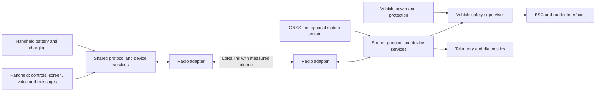
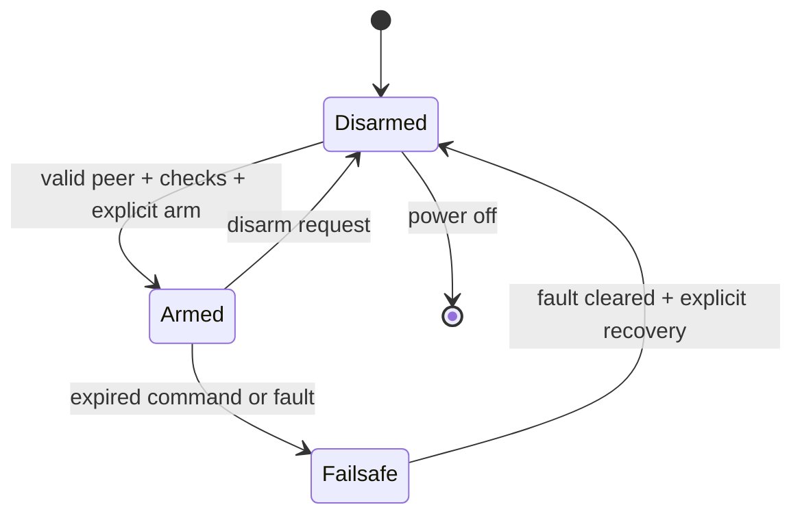

# A reusable LoRa controller family

Concept draft, 2026-09-17. These are proposed design boundaries, not selected components, a validated pin map or approved V2 requirements. Preserve the faithful V1 baseline first. Jay explicitly selected **voice plus text and location** for the handheld. Voice is a required product capability; its operating mode and achievable performance need validation before radio selection.

## Shared core, purpose-specific interfaces

Reuse radio transport, device identity, configuration, diagnostics and message definitions across products. Keep propulsion safety local to the vehicle. A handset can present multiple tools while each connected device advertises only capabilities it actually supports.

The diagram describes logical modules. Start with reusable firmware and documented electrical interfaces; decide later whether physical plug-in boards justify their connector cost, size, sealing and reliability tradeoffs. A single PCB with every feature populated should not be assumed.

| Shared platform element | Boat / RC endpoint | Handheld communicator |
|---|---|---|
| Identity and protocol version | Bound controller, explicit authority to actuate | Selected peer, visible mode and peer identity |
| Radio adapter | Verified UART module initially; later radio driver behind same interface | Compatible transport and measured link status |
| Power management | Protected input, monitored battery, separate actuator supply | Battery protection, charging and sleep behavior |
| Application services | Control, telemetry, navigation, faults | Controls, voice, messages, location, configuration |
| Diagnostics | Reset cause, command age, fix age, supply faults | Delivery state, peer state, latency and fault display |
| Expansion | GNSS/PPS, sensors and justified CAN interface | GNSS, display, buttons/joysticks and optional accessories |

Do not allocate MCU pins yet. Keep STM32F446 as the reference until peripheral use, power budget and boot/debug requirements are reconciled. Reserve a requirements table for each interface: voltage, current, direction, connector orientation, pull state at reset, protection and failure behavior.

## Radio service contract

Use a versioned envelope with source/destination, service type, session identifier, sequence number, payload length and integrity/authentication definition. Radio-network identifiers alone should not be the application's authority to actuate. Provisioning and key management need their own threat model before selecting a scheme.

- **RC:** atomic thrust/rudder setpoint, explicit arm/disarm, latest valid command wins, local receive-age timeout, stale/replayed commands rejected. Do not queue old throttle commands for later retransmission.
- **Telemetry:** bounded cadence and queue; replace stale samples with newer values. Include fix age and health, not coordinates alone.
- **Messages:** bounded retries, message ID, deduplication and visible pending/delivered/failed status. Receipt and human reading are different events.
- **Voice:** explicit session ownership, bounded audio frames and latency, visible transmit/receive state, and a policy for interaction with RC authority. Expired live audio should not accumulate indefinitely.
- **Configuration:** apply through a controlled transaction while disarmed; acknowledge versions and reject incompatible profiles.

Control priority must include airtime already in progress: queue priority cannot interrupt a long packet on the air. Set a maximum background-packet duration, reserve control opportunities, and test simultaneous traffic. For each candidate radio setting record payload bytes including module overhead, time on air, turnaround, retry budget, maximum blocking interval and measured tail latency. Select failsafe timing from the vehicle's tolerable uncontrolled travel and measured delays. No fixed kilometer claim or control rate is accepted yet.

The [REYAX RYLR998/498 guide](https://reyax.com/upload/products_download/download_file/LoRa_AT_Command_RYLR998_RYLR498_EN.pdf) documents SF/BW restrictions, an additional eight payload bytes, and acknowledgment sequencing. First identify the installed model and read back its settings; the current SF12 command cannot simply be assumed valid for RYLR998.

## Voice feasibility comes before the radio commitment

Evaluate two modes against the desired range, intelligibility and delay. Do not silently reduce the requirement to text if a candidate module fails.

| Candidate mode | Design question | Required demonstration |
|---|---|---|
| Live half-duplex push-to-talk | Can useful speech frames meet their deadlines at the required link margin while preserving control access? | Two endpoints with recorded packet timing, end-to-end speech delay, loss behavior and intelligibility at target settings |
| Recorded voice messages | Is capture-then-send acceptable, and how long does delivery take? | A bounded recording transmitted, reassembled and played with clear delivery/failure status under packet loss |

Proposed audio chain: microphone → capture → speech codec → timestamped/numbered fragments → radio service → bounded reassembly/jitter buffer → decoder → speaker/headset. Choose no codec or module until measured codec output plus framing, authentication, module overhead and retry allowance fits the airtime budget. Include codec CPU/RAM, audio storage, microphone/speaker power and enclosure acoustics in the hardware assessment.

RC and voice on the same channel is a separate acceptance case, not assumed from either working alone. Test the longest voice frame, simultaneous telemetry, packet loss and control timeout. Possible policies to evaluate are strict control reservation with voice admission limits, or distinct communicator and armed-RC modes. A second radio is a trade study only if coexistence cannot meet the requirements. Establish regional operating constraints for the selected band and emission mode before committing hardware.

## Vehicle state proposal

Define output behavior in every state, including reset and boot before firmware runs. Reconnection must not restore an old throttle setting automatically. ESC idle is device-specific; verify pulse/power sequencing against the actual unit. Treat return-to-home as a later navigation function with its own sensor and fault prerequisites; it is not the default response to every failure.

## Make the project easy to use

Proposed documentation front door: **Open design · Understand wiring · Reproduce validation · Bench test · Change design**. Each target links to one maintained source, rather than duplicated instructions.

For schematics, use a root functional map followed by power, MCU/debug, radio, positioning, actuator I/O and optional CAN sheets. Place connectors near their subsystem, show signal direction, and mark rail boundaries. Each connector gets a small pin-numbered view with viewing direction and cable orientation. Every sheet includes revision, purpose and verification references. V1 warnings stay visibly marked as inherited conditions.

Create a connector atlas linking: connector pin → MCU pad → peripheral → firmware function → voltage → expected bench measurement. Pair top/bottom copper overlays with highlighted PWM, VCAP and CAN paths. Show fabrication evidence and reconstructed exports side by side with revision labels. Generate PDF/SVG views from released CAD so pictures cannot silently drift from the design.

## Measurable requirement seeds

| Proposed ID | Requirement to finalize | Acceptance evidence |
|---|---|---|
| CTL-01 | Safe output within agreed `T_loss` after last valid command | Logic-analyzer traces under silence, malformed traffic and saturated downlink |
| CTL-02 | No unintended actuation during boot, reset, brownout or reconnect | Repeated power/reset sweeps; actual ESC characterization |
| RF-01 | Agreed worst-case command age under concurrent messaging | Timestamped link tests across supported settings and loss rates |
| VOC-01 | Voice at agreed range, intelligibility and end-to-end delay | Recorded two-endpoint audio/link trial with exact codec, settings and antenna conditions |
| VOC-02 | Voice traffic cannot violate armed-RC command/failsafe timing | Saturated voice/telemetry test with measured control deadlines and fault injection |
| NAV-01 | Fix older than agreed `T_fix` cannot be used as current | Recorded NMEA replay with silence, invalid status and malformed fields |
| PWR-01 | Actuator/BEC supply cannot backfeed logic beyond specified limits | Power-tree review and measured fault/connection cases |
| DOC-01 | New engineer can identify every external pin without opening source code | Connector atlas cross-check against released netlist |
| REPRO-01 | One documented sequence reproduces the released artifacts | Clean isolated checkout; hashes, logs and tool versions |

`T_loss`, `T_fix`, command-age limits and electrical limits are intentionally unresolved parameters. Requirements are not ready for acceptance until numeric bounds and operating conditions are recorded.
