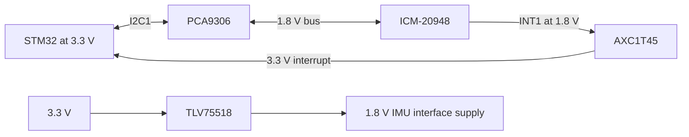

# V2 electrical release review — 2026-09-17

**The published V2 circuit is not electrically ready for fabrication.** This bounded review identifies component-limit conflicts that ERC cannot detect. It changes no CAD, firmware, order file or historical evidence. The starting revision is `07c0f3572bf877a9d398c545d9a97f84a8b27cb7`; [evidence.json](evidence.json) records seven source hashes, 24 native-netlist pin mappings and reproducible calculations. The two pre-existing local routing/generator edits were not used.

This is an independent comparison of the published native netlist and design data against manufacturer documentation. It is not a new native export, simulation, bench measurement or release approval. The correction circuits below are proposals requiring implementation and validation.

## Verified blockers and precise dispositions

| ID | Existing circuit evidence | Limit and consequence | Smallest correction and acceptance evidence |
|---|---|---|---|
| E-01, critical | U6 pin 8 VDDIO and pin 22 CS are on +3V3; R23/R24 pull SCL/SDA to +3V3. | ICM-20948 VDDIO operating range is 1.71–1.95 V, absolute maximum 2.5 V. The current supply exceeds both. Correcting only its supply leaves the bus overvoltage problem. [TDK DS-000189 rev 1.6, pp. 13–14, 18–20](https://cdn.sparkfun.com/assets/8/4/6/4/2/ds-000189-icm-20948-datasheet-2024.pdf#page=13). | Add a 1.8 V domain and translate SCL/SDA and INT1; move CS to 1.8 V. Keep U6 VDD at +3V3. Proposed pin contract below. Verify netlist isolation, rail limits, I2C transactions and interrupt thresholds. |
| E-02, high | U4/U5 pin 5 and C13/C14 are powered by VSERVO, after the two source OR-ing diodes. | SN74AHCT1G125 requires 4.5–5.5 V. A nominal 6 V BEC minus a load-dependent diode drop does not guarantee this window; a loaded 5 V source can also fall below it. Its 7 V absolute maximum is not an operating rating. [TI SCLS378P, p. 4](https://www.ti.com/lit/ds/symlink/sn74ahct1g125.pdf#page=4). | Move these four supply connections to regulated +5V_BUCK before D4 and make the buck mandatory whenever PWM outputs are populated. Preserve VSERVO exclusively for actuator power. Verify buffers remain 4.5–5.5 V across source/load combinations and PWM stays low during startup/brownout. |
| E-03, critical | D1 is SMAJ33A on VIN_RAW; U8 IN+ sees that rail, IN− and both buck VIN pins see it through 20 mΩ. | D1 breakdown begins at 36.7 V; its rated clamp is 53.3 V at 7.5 A. U8 common-mode absolute maximum is 26 V; U3 VIN absolute maximum is 30 V; U2 VIN absolute maximum is 32 V. This protection network cannot justify a protected 6S input. [Littelfuse SMAJ table](https://www.littelfuse.com/assetdocs/littelfuse_tvs_diode_smaj_datasheet?assetguid=13c2a823-03b8-4d1f-9ddc-9b44670aed9d), [TI INA180, p. 7](https://www.ti.com/lit/ds/symlink/ina180.pdf#page=7), [TI TPS54202, p. 4](https://www.ti.com/lit/ds/symlink/tps54202.pdf#page=4), [Nisshinbo R1240, p. 4](https://www.nisshinbo-microdevices.co.jp/en/pdf/datasheet/r1240-ea.pdf#page=4). | Choose an explicit power envelope. Keeping 2S–6S requires a coordinated higher-voltage input stage or active surge cutoff, including sense amplifier, Q1, catch diode and divider. A separate reduced-voltage prototype option is described below. Neither changing a TVS label nor a 3 A fuse establishes surge protection. |
| E-04, high | R6=100 kΩ connects VIN_BUCK directly to U3 EN with no divider or specified clamp. | TPS54202 EN absolute maximum is 7 V. A series resistor alone does not establish its steady-state voltage. TI explicitly permits EN floating for enabled operation. [TI SLVSD26C, pp. 4, 9](https://www.ti.com/lit/ds/symlink/tps54202.pdf#page=9). | Remove/DNP R6 and explicitly leave EN floating, or implement the datasheet UVLO divider. Do not claim that an undocumented internal clamp makes this connection valid. Verify EN and startup over the selected input range. |
| E-05, high | U8 OUT and C37=100 nF directly share ISENSE with MCU PA4. | INA180 specifies a 1 nF maximum capacitive load for no sustained oscillation. C37 is 100 times that value. The datasheet recommends output RC filtering for a high-impedance receiver. [TI SBOS741H, pp. 8, 23](https://www.ti.com/lit/ds/symlink/ina180.pdf#page=8). | Add 1 kΩ between U8 OUT and the existing PA4/C37 node. Proposed time constant is 100 μs. Verify stability, ADC settling and calibration; do not cite the added RC as already measured. Add a local U8 supply bypass if absent from placement. |
| E-06, high | L2=4.7 μH and the advertised output is 5 V / 2 A over 2S–6S. | At 25.2 V, 390 kHz minimum switching frequency, nominal L and calculated 5.077 V output, ideal ripple is 2.212 A p-p: a 2 A load needs 3.106 A peak, above the 2.5 A minimum high-side limit. Inductor tolerance increases the concern. [TI SLVSD26C, pp. 5, 15](https://www.ti.com/lit/ds/symlink/tps54202.pdf#page=15). | Recalculate L2, its saturation/thermal ratings and output capacitors for the selected rail/load envelope; 15 μH is a study starting point from TI's example, not a qualified substitute in the current footprint. Derate the output claim until worst-case calculations and load-step tests pass. |

The net names and components in the first column come from project evidence; limits come from the linked documents; consequences and correction choices are engineering inferences. No part has been ordered.

## AD0 warning versus the real IMU defect

The recorded ERC warning is `Bidirectional` U6 pin 9 connected to the GND power flag. In I2C mode, that pin selects the address: grounding it selects **0x68**. This is consistent with the datasheet's I2C description; it does not diagnose the VDDIO fault. A project-specific I2C symbol may type AD0 as an input after the mode is fixed and documented. Preserve the actual ground connection. Do not downgrade the global ERC rule or alter the generic manufacturer's symbol to silence every bidirectional conflict. [TDK DS-000189 rev 1.6, pp. 19, 28](https://cdn.sparkfun.com/assets/8/4/6/4/2/ds-000189-icm-20948-datasheet-2024.pdf#page=28).

The latest datasheet also corrects digital-input absolute maximum to **VDDIO + 0.5 V**, whereas older revisions used VDD in that row. The manufacturer-hosted revision 1.6 URL failed during this audit; the linked SparkFun file is the **TDK-authored original revision 1.6**, not a third-party tutorial. The revision date and table were checked. Direct 3.3 V pull-ups remain invalid after a 1.8 V supply is added. Keep unused FSYNC grounded and retain the no-exposed-pad footprint; this review does not propose a footprint swap.

## Proposed minimal IMU correction contract

These allocations retain ICM-20948 and existing MCU pins. New reference designators must be assigned during CAD integration. They are not part of the released BOM yet.

| Element | Proposed connections | Verified basis |
|---|---|---|
| TLV75518PDBVR, SOT-23-5 | Pin 1 IN and pin 3 EN to +3V3; pin 2 GND; pin 4 NC; pin 5 OUT to `+1V8_IMU`. Add at least 1 μF effective ceramic capacitance on IN and OUT. | DBV pin map pp. 3–4; input range 1.45–5.5 V; exact 1.8 V orderable part in package addendum. [TI TLV755P rev D](https://www.ti.com/lit/ds/symlink/tlv755p.pdf#page=3). |
| U6 power | Pin 8 VDDIO and pin 22 CS to +1V8_IMU; pin 13 VDD stays +3V3. C34 stays local to VDD; add separate 100 nF bypass at VDDIO. Pin 9 AD0 stays GND. | E-01. Do not power external loads from U6 REGOUT. |
| PCA9306DCTR, SSOP-8 | Pin 1 GND; pin 2 VREF1 to +1V8_IMU; pins 3/4 to new `IMU_SCL_1V8` / `IMU_SDA_1V8`; pins 6/5 to existing MCU I2C1_SCL/SDA. Tie pins 7/8 together, then through 200 kΩ to +3V3. Add 100 kΩ bleeder from +1V8_IMU to GND to sink reference-bias current in low-load states. | Pin map p. 4; reference translation topology p. 13 and LDO bias guidance pp. 14–15. [TI PCA9306 rev O](https://www.ti.com/lit/ds/symlink/pca9306.pdf#page=13). |
| Bus pull-ups | Keep R23/R24=2.2 kΩ only on the MCU side. Add 4.7 kΩ from each sensor-side line to +1V8_IMU. The initial bus clock is 100 kHz; raise only after observing rise/fall times. | Proposed pull-up budget; two sides are electrically distinct. Sum of nominal pull-up currents is about 1.9 mA; verify low voltage and rise time on both sides. |
| SN74AXC1T45DBVR, SOT-23-6 | Pin 1 VCCA to +1V8_IMU; pin 2 GND; pin 3 A to U6 INT1; pin 4 B to MCU PB5; pin 5 DIR to +1V8_IMU for A→B; pin 6 VCCB to +3V3. Bypass both supplies. Use push-pull interrupt mode; add a weak A-side pull-down if required for unpowered input behavior. | DBV pin map p. 3; direction table p. 18. The two supplies support the proposed voltage translation. [TI SN74AXC1T45 rev E](https://www.ti.com/lit/ds/symlink/sn74axc1t45.pdf#page=18). |

This corrects voltage domains while keeping the navigation feature and current MCU allocation. It still requires footprint review, placement/routing, ERC/netlist checks, power-sequence measurement and an IMU read/interrupt test. These parts are circuit candidates, not supply-chain or assembly-qualified selections.

## Input-power decision and other margins

For a small first prototype, a **separate 2S–3S option** could retain much of the existing power stage, with an appropriately lower TVS. For example, SMAJ15A specifies 15 V stand-off and 24.4 V clamp at 16.4 A. That is a calculation candidate only: verify temperature derating, overshoot at the actual protected pins, pulse energy and fuse coordination. This option **does not meet the existing 6S requirement**, and must not be silently substituted for it. Maintaining 6S needs a reviewed input protection redesign; an INA180 input that tolerates only 26 V leaves merely 0.8 V above a fully charged 25.2 V pack. [Littelfuse SMAJ electrical characteristics](https://www.littelfuse.com/assetdocs/littelfuse_tvs_diode_smaj_datasheet?assetguid=13c2a823-03b8-4d1f-9ddc-9b44670aed9d).

The 47 kΩ / 6.8 kΩ battery divider gives 3.185 V at 25.2 V nominal. At the written 26 V measurement endpoint and worst 1% resistor ratio, it reaches 3.344 V. The board's nominal regulator setting is about 3.35 V, but this does not establish minimum VDDA or ADC headroom under tolerance and transients. Recalculate divider and protection against guaranteed minimum VDDA; a calibrated 1% system accuracy claim also needs an error budget. This calculation is in [evidence.json](evidence.json).

Q1 AO3401A has −30 V VDS and ±12 V VGS absolute ratings. The existing 10 V gate zener addresses the gate limit in principle; it does not improve the drain rating or resolve the TVS mismatch. Gate-clamp tolerance/current and reverse-input behavior remain qualification items. [AOS AO3401A, p. 1](https://www.aosmd.com/pdfs/datasheet/AO3401A.pdf#page=1).

**VCAP is not a blocker:** STM32F446RE LQFP64 has one VCAP pin. Existing C20=4.7 μF from pin 30 to ground matches the single-pin requirement, ESR below 1 Ω. Preserve it and verify the selected capacitor's effective capacitance and placement. Do not substitute 2.2 μF based on the two-VCAP package rule. [ST DS10693 rev 11, pp. 77–78, table 18](https://www.st.com/resource/en/datasheet/stm32f446re.pdf#page=78).

## Next smallest implementation packet

Implement E-01 as an isolated circuit revision, with named 1.8 V nets and an explicit expected pin-delta list. Regenerate only the required outputs, inspect the navigation drawing, route the additions, and compare every changed connection against the contract above. Resolve E-02/E-04/E-05 together as the subsequent power/interface packet. E-03 needs an explicit selected battery/protection envelope, and E-06 needs a complete output-stage calculation before hardware release. Preserve this pre-correction evidence rather than overwriting it.

Reproduce this capture with `python reviews/codex/design_completion/electrical/capture_evidence.py` only while the starting revision remains unchanged; for later revisions write a new dated capture. The script performs no CAD generation. A native clean result after correction is necessary but does not replace the voltage-domain or hardware acceptance checks above.
